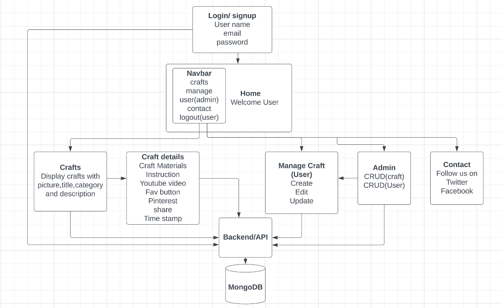
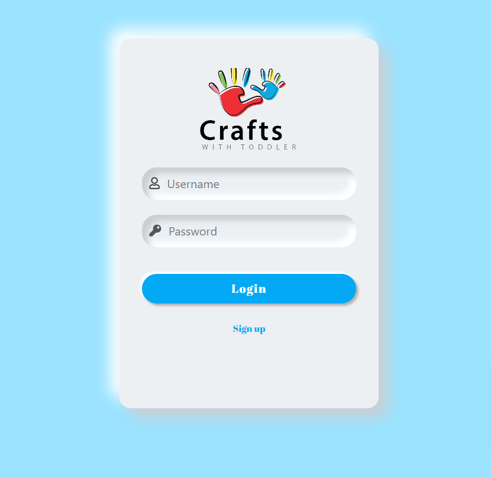
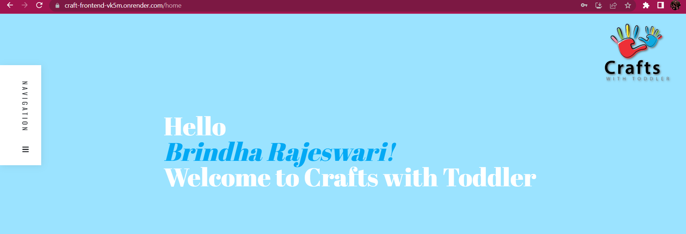

# Fullstack MERN App - Crafts with Toddler

Introduction:
-------------
I run a youtube channel "Crafts with Toddler" 
https://www.youtube.com/@CraftswithToddler.
I have facebook, instagram, pinterest page for my craft channel but didnt have a website. Learning MERN why not create my own website by applying my knowledge and here is it .... Crafts with Toddler welcomes you :)

Technology used:
----------------
MERN - MongoDB, Expressjs, Reactjs and Node.
GitHub
VScode

Project planning:
-----------------
Created a Entity- Relationship diagram - Structure for my craft app

I used Trello as a daily tracker to help organize my work flow
https://trello.com/b/JOIyIjKW/to-dos

My project - Kids craft app:
-----------------------------

* Created Login and home page. 
* login page - styled with bootstarp
* Home page layout and Nav bar - styled with Codepen

Craft page:
----------
* Craft page displays craft pictures. when you flip the card, it shows craft title, category and short description. when you click the craft it takes you to craft details page

Craft Detail page:
------------------
* This page displays Title, Materials and instructions to do the carft with youtube video.
* It also has the timestamp when the craft was uploaded on the website.
* This page is not listed on the navbar

Contact page:
--------------
Links to crafts with toddler insta and twitter page

Future Enhancement:
--------------------

* Content: Create high-quality content that is informative, engaging, and relevant to my users. Consistency is key, so develop a content plan and publish posts regularly.

* Social media integration: Share my craft content on social media platforms such as Facebook, Twitter, and Instagram to increase my reach and engage with my audience.

* Search engine optimization (SEO): To optimize my blog content for search engines to increase visibility and attract more traffic to my blog.

* Analytics:Have to use analytics tools to track my website's traffic, engagement, and performance. This can help me to make informed decisions about my content and marketing strategies.

------------------------------------------------------------------------------

GitHub Link - https://github.com/brindharajeswari/craft_App
render.com Link - https://craft-frontend-vk5m.onrender.com

------------------------------------------------------------------------------

