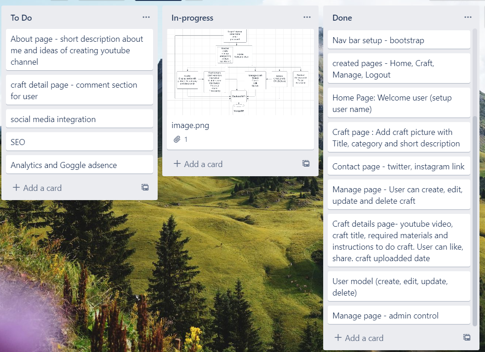

# Fullstack MERN App - Crafts with Toddler

Introduction:
-------------
I run a youtube channel "Crafts with Toddler" 
https://www.youtube.com/@CraftswithToddler.
I have facebook, instagram, pinterest page for my craft channel but didnt have a website. Learning MERN why not create my own website by applying my knowledge and here is it .... Crafts with Toddler welcomes you :)

Technology used:
----------------
MERN - MongoDB, Expressjs, Reactjs and Node.
GitHub
VScode

Project planning:
-----------------
Created a Entity- Relationship diagram - Structure for my craft app

I used Trello as a daily tracker to help organize my work flow
https://trello.com/b/JOIyIjKW/to-dos

My project - Kids craft app:
-----------------------------
Created Login and home page. 
login page - styled with bootstarp
Home page layout and Nav bar - styled with Codepen

